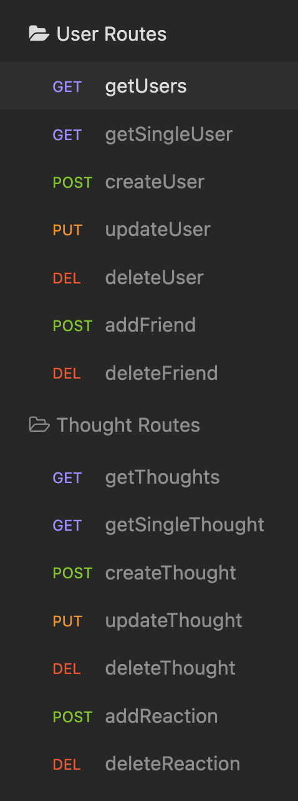

# Social Network API

## Walkthrough Video
[Walkthrough Video](https://drive.google.com/file/d/1wKBubikoZgd1hSemhmoZcX9Ls727kb7_/view)

## Description
This API was created for a social network that uses a NoSQL database so that the website can handle large amounts of unstructured data. Users can share thoughts, react to friends' thought and create a friend list.

## Table of Contents
- [Installation](#Installation)  
- [Usage](#Usage)
- [License](#License)
- [Contributing](#Contributing)
- [Questions](#Questions)

## Installation
- [Node.js](https://nodejs.org/en/)
- [Express](https://www.npmjs.com/package/express)
- [Mongoose](https://www.npmjs.com/package/mongoose)

## Usage
Once Express and Mongoose have been installed, open the server.js file in the terminal. Type in 'npm start' to start the server. 

## License
MIT

## Contributing
[Sara Baqla](https://github.com/missatrox44)  
[Kyle Baca](https://github.com/kyle-david1) 
[Andrew Cooke](https://github.com/andcooke) 

## Questions
Github username: [missatrox44](https://github.com/missatrox44)  
Email: missatrox44@gmail.com